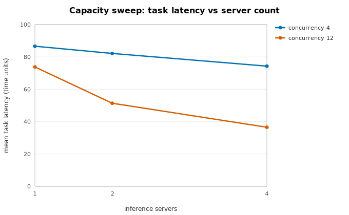
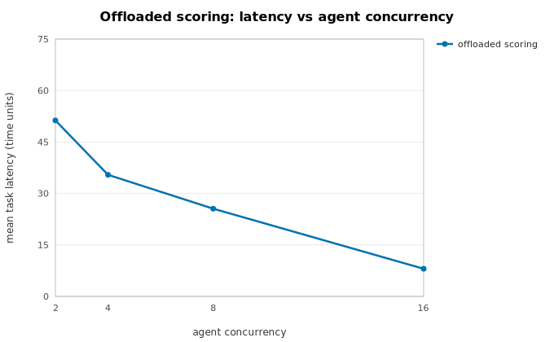

# LLM agentic workflow

A multi-agent task pipeline that **models** an LLM-serving system — and never
makes a real LLM or network call. It walks the sequential core (5.3) and both
parallelism showcases (5.4), and links back to
[Which parallelism do I need?](../parallelism-decision-tree.md).

The code lives in [`examples/agentic_workflow/`](https://github.com/nobelk/llmsim/tree/main/examples/agentic_workflow).

## The core model

Tasks arrive at an orchestrator (Poisson). Each becomes an agent process that
alternates:

- **think** steps — inference requests queued at shared, batching LLM-server
  `Resource`s with token-length-dependent service times. Under load the queue
  backs up and batches grow; under light load a batch is one request — both
  deterministically.
- **act** steps — tool calls with stochastic latency, failures, and bounded
  retries. A call that fails every attempt surfaces the failure, aborting the
  task.

Bounded agent concurrency is a finite-capacity `Resource`. KPIs are end-to-end
task latency, inference-queue depth, and cost per task.

```python
from examples.agentic_workflow import AgenticConfig, run_sequential

kpis = run_sequential(seed=20260712, config=AgenticConfig())
print(kpis.mean_latency, kpis.mean_queue_depth, kpis.mean_cost)
```

!!! warning "No network, ever"
    The example *simulates* an LLM server: every service time is drawn from
    `sim.rng`. A test disables all socket entry points, bans network/LLM imports
    from the package by AST scan, and asserts the model still runs with no
    `llmsim[llm]` extra installed — the no-network rule is enforced, not assumed.

## Showcase 5.4a — capacity-planning sweep

`study_capacity.py` builds an `Experiment` over a (server count × batch size ×
agent concurrency) grid, runs independent replications, and reports a 95%
confidence interval per KPI. Same Phase 2 guarantee: **bit-identical on any
backend or worker count** for a fixed master seed.



Latency falls as servers and agent concurrency rise — the trade-off surface a
capacity planner reads. Regenerate with
`python -m examples.agentic_workflow.study_capacity`.

!!! note "Slowdown regime"
    Replication throughput follows the measured
    [replication-scaling curves](../perf/replication-scaling.md); absolute
    speedup on anti-scaling interpreters is recorded-not-blocking.

## Showcase 5.4b — strict-mode offload

`offload.py` moves the per-think-step **routing score** — a deliberately
CPU-heavy pure function — onto the offload worker pool via
`sim.offload(..., strict=True)`. In strict mode the result is delivered at a
deterministic completion slot regardless of which backend computes it, so the
run is **bitwise-identical whether the pool is `inline` or a real worker pool**.
Wall-clock worker latency never leaks into the simulated trace.



The curve is the offloaded model's latency as concurrency rises; every point is
identical across the `inline`, `threads`, and `processes` backends — that
equivalence is the whole point. Regenerate the trace-equivalence check with
`pytest tests/test_agentic_offload.py`.

!!! note "Slowdown regime"
    Offload wall-clock speedup is bounded by the **max-vs-sum ceiling**: the sim
    thread waits for the *slowest* concurrent offload, not the sum, so speedup
    saturates once the pool covers the concurrent batch (see
    [performance notes](../perf-notes.md)). The determinism guarantee holds at
    any speedup.
