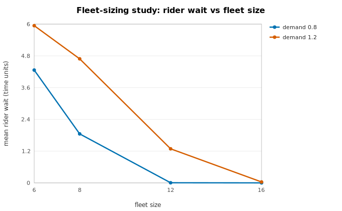
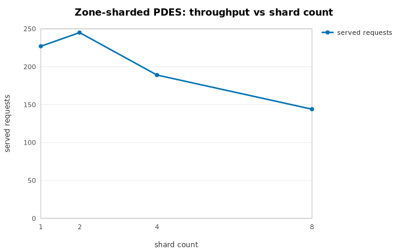

# Ride-hailing fleet

An autonomous robotaxi fleet serving Poisson trip requests over a discrete
**zone graph**, built entirely on the public llmsim API. It walks the sequential
core (5.1) and both parallelism showcases (5.2), and links back to
[Which parallelism do I need?](../parallelism-decision-tree.md).

The code lives in [`examples/ride_hailing/`](https://github.com/nobelk/llmsim/tree/main/examples/ride_hailing).

## The core model

Zones are nodes on a **ring** with fixed inter-zone travel times and a strictly
positive minimum. That minimum matters twice: it is the shortest deadhead a
dispatch policy can see, and it is exactly the channel lookahead the sharded
variant needs. Continuous coordinates would give adjacent points a ~0 lookahead
and no feasible sharding — so the geometry is discrete by design.

Each vehicle is a generator process running the full lifecycle — idle → drive to
pickup → carry the trip → drop off → reposition → recharge — with a
state-of-charge depleted by travel. Charging stations are finite-capacity
`Resource`s; idle vehicles wait in a `FilterStore`; requests abandon if
unassigned within a patience window.

```python
from examples.ride_hailing import RideHailingConfig, run_sequential

kpis = run_sequential(seed=20260712, config=RideHailingConfig())
print(kpis.mean_wait, kpis.mean_utilization, kpis.abandonment_rate)
```

### Dispatch policies

A request pulls out the vehicle its **dispatch policy** ranks best across *all*
zones — never restricted to the origin zone — with ties broken by ascending
vehicle id, so the choice never depends on `FilterStore` order:

- `closest_available` — the nearest idle vehicle by inter-zone travel time.
- `power_of_d` — sample `d` idle candidates via `sim.rng`, then pick the
  nearest.

Both sit behind one protocol and are selected through the config, so policy
choice flows through the seed tree deterministically.

## Showcase 5.2a — fleet-sizing Monte Carlo

`study_fleet_sizing.py` builds an `Experiment` over a (fleet size × demand) grid,
runs independent replications, and reports a 95% confidence interval per KPI.
This is the Phase 2 showcase: many independent `Sim`s, one per worker,
**bit-identical on any backend or worker count** for a fixed master seed.



Rider wait collapses as the fleet grows past the demand it serves — the curve a
capacity planner reads to size a fleet. Every point is a deterministic study
output; regenerate with `python -m examples.ride_hailing.study_fleet_sizing`.

!!! note "Slowdown regime"
    Replication throughput follows the measured
    [replication-scaling curves](../perf/replication-scaling.md): near-linear on
    the process backend, flat-to-anti-scaling on free-threaded threads under
    refcount contention. Absolute speedup on anti-scaling interpreters is
    recorded-not-blocking; the *results* are identical regardless.

## Showcase 5.2b — zone-sharded PDES

`sharded.py` partitions the fleet into zone-group **shards**, one `Sim` each, run
thread-per-shard. Each shard serves its own requests from its own fleet; a trip
whose destination lies in another zone group becomes a **vehicle migration** — a
channel message carrying plain `(vehicle_id, soc, zone)` data with
`delay = trip_time`, which is always at least the minimum inter-zone time. That
minimum is the channel lookahead.



The curve holds the **total** demand fixed (each shard serves its zone-group's
share, `request_rate / shards`) and varies only the partition. Throughput peaks
around two shards and then falls: partitioning the same workload fragments the
fleet, so each shard has fewer local vehicles to serve its own requests. That is
the honest PDES trade-off — the point is not a free speedup but that the
determinism guarantee holds at *every* shard count.

Global cross-zone *dispatch* (ranking vehicles a shard does not own) is not
share-nothing-decomposable, so the sharded variant uses local dispatch plus
migration — an honest PDES decomposition, not a bitwise clone of the monolithic
model. The guarantee it proves is the Phase 3 one: the **threaded run is
bitwise-identical to the sequential reference** (`mode="sequential"`) of the same
topology, at 1/2/4 shards.

!!! note "Slowdown regime"
    Shard scaling degrades as the channel lookahead shrinks toward the local
    event spacing (see [PDES scaling](../perf/pdes-scaling.md), lookahead → 0).
    The ring metric keeps the minimum inter-zone time strictly positive, which is
    what makes sharding feasible here at all.
