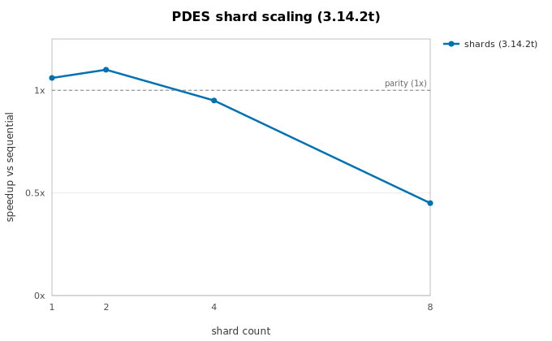
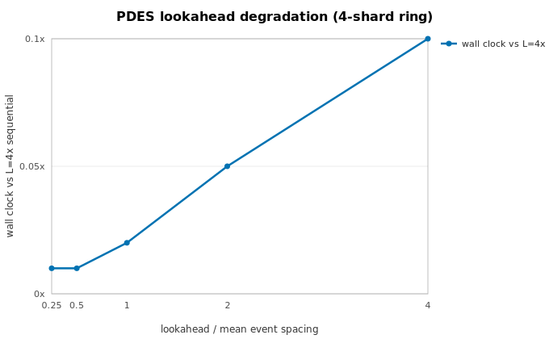

# PDES scaling

Measured scaling of [single-run PDES sharding](../guide/pdes.md) — the Phase 3
capability. **Every number here is measured**; the charts are rendered from the
recorded data by `scripts/generate_perf_charts.py`, and the slowdown regimes
are stated alongside.

## Measurement setup

- **Benchmark:** `benchmarks/pdes_scaling.py` — a balanced serpentine grid
  conveyor (~410k events), timing full `topo.run()` wall clock **including**
  barriers, versus the sequential reference runner.
- **Machine:** Apple M5 (4P+6E), macOS, CPython 3.14.2t unless noted.
- **Correctness is unconditional** — the bitwise trace-equivalence suite gates
  every build at 1/2/4/8 shards plus a jittered soak; these are the performance
  record only.

## Shard scaling

Speedup peaks at **1.10×** at 2 shards and falls away (0.95× at 4, 0.45× at 8).

!!! note "Status of the ≥3×-at-8-shards roadmap figure"
    Not demonstrated on current interpreters, as the Phase 3 spec anticipated.
    PDES shards are threads running the Phase 1 engine hot loop concurrently,
    and CPython 3.14.2t's reference-count contention on shared objects (the same
    ceiling the [replication threads backend](replication-scaling.md) hits) caps
    thread-parallel DES at ~1.1× regardless of the synchronizer's quality. The
    figure will be asserted when a CPython build scales pure-Python event loops
    across threads. GIL build for comparison: 0.90× at 2 shards — correct,
    time-sliced, prominently warned.

## Lookahead degradation

The textbook conservative-PDES slowdown regime. On a 4-shard ring with local
event spacing 0.25, wall clock is plotted against the lookahead / mean-spacing
ratio (relative to the L=4× sequential run):

The horizon advances at most **one lookahead per round**, so *halving lookahead
doubles the number of barrier rounds* — the wall clock doubles down the whole
sweep. With lookahead at or below the mean event spacing, a sharded run is
dominated by synchronization and is strictly slower than sequential. Use
`llmsim.parallel.pdes.analyze()` on a sequential trace to estimate the window
economics **before** partitioning.

## Slowdown regimes

- **Low lookahead** — see the sweep above; lookahead must be a large multiple of
  the mean event spacing for windows to carry meaningful work.
- **Unbalanced shards** — the window cost is the busiest shard's; a 90/10 split
  caps speedup at ~1.1× no matter the core count (`analyze()` reports this as
  `balance_speedup`).
- **GIL builds** — time-sliced threads: correct, warned at runtime, never faster
  than sequential.
- **3.14.2t thread contention** — the interpreter-level ceiling above; today it
  dominates every other regime on free-threaded builds.

The full narrative and the CI regression gate are in the
[Performance overview](../perf-notes.md#phase-3-single-run-conservative-pdes).
