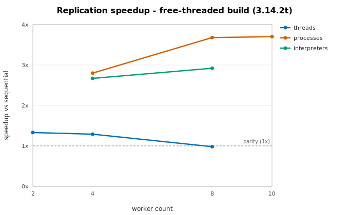
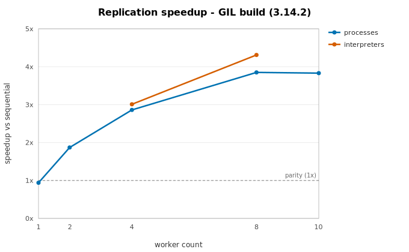

# Replication scaling

Measured throughput of [parallel replications](../guide/replications.md) — the
Phase 2 capability — as worker count grows. **Every number here is measured**;
the charts are rendered directly from the recorded data by
`scripts/generate_perf_charts.py`, and the slowdown regimes are stated
alongside (mission principle 3: honest performance claims).

## Measurement setup

- **Benchmark:** `benchmarks/replication_scaling.py` — 64 replications of an
  ~20 ms M/M/1, timing `Experiment.run` wall clock **including** executor
  startup and result transport, versus a pure in-process sequential loop.
- **Machine:** Apple M5, 10 physical cores (**4 performance + 6 efficiency**),
  macOS.
- **Builds:** CPython 3.14.2 (GIL) and 3.14.2t (free-threaded).
- **Signal:** ratios (speedup vs sequential) are the portable signal; absolute
  times are hardware-specific. Correctness is unconditional and gated
  separately — these are the performance record only.

## Free-threaded build (3.14.2t)

On the free-threaded build the `processes` backend reaches **3.70×** at 10
workers, while the `threads` backend peaks at 1.33× (2 workers) and then
*degrades* to 0.98× at 8.

## GIL build (3.14.2)

On the GIL build `auto` picks processes; `interpreters` reach **4.31×** at 8
workers and `processes` **3.85×**.

For context, an embarrassingly parallel pure-CPU baseline measures **4.69×** at
8 workers on this machine — the 4P+6E core asymmetry, not coordination
overhead, is the dominant cap. The process backend reaches ~80–90% of that
ceiling.

!!! note "Status of the ≥6×-on-8-cores roadmap target"
    Not yet demonstrated, honestly. This 10-core machine is heterogeneous
    (4P+6E); even perfect scaling cannot show 6× at 8 workers here. The measured
    per-core efficiencies (0.94×/core at 2 workers, 0.72–0.77×/core at 4) are
    consistent with ≥6× on 8 *homogeneous performance* cores, but per the
    docs-honesty rule that figure is recorded only when measured on such a
    machine.

## Slowdown regimes

- **Threads anti-scale for DES event loops on 3.14.2t.** The engine's and
  `random.py`'s hot paths repeatedly touch objects shared by every thread, and
  reference-count cache-line contention currently outweighs the parallelism
  (1.33× at 2 workers → 0.98× at 8). Use `backend="processes"` for replication
  studies even on the free-threaded build.
- **Process startup dominates small studies.** A study whose *total sequential*
  runtime is under ~1 s can be slower with processes than sequentially
  (`workers=1` measures 0.94×). Size studies to seconds.
- **Result transport is per-replication overhead.** On the process and
  interpreter backends every config and result crosses a pickle boundary
  (zstd-compressed when `spool=True`). Return KPIs, not raw traces.
- **Efficiency cores flatten the top of every curve.** Beyond the number of
  performance cores each extra worker adds only a fraction of a core's
  throughput; `max_workers = physical cores` is the sweet spot.

The full narrative, the CI regression gate, and RSS guidance are in the
[Performance overview](../perf-notes.md#phase-2-parallel-replications).
